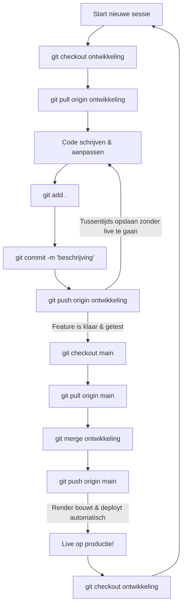

# Alonco Git & GitHub Workflow Handleiding

Deze handleiding beschrijft de volledige workflow voor het beheren van de code in de **Alonco Calculatiesoftware** repository. 

We maken gebruik van een veilige branching-strategie om te voorkomen dat onafgemaakte code direct live gaat op Render. Render luistert naar de `main` branch voor automatische deployments, terwijl de dagelijkse ontwikkeling plaatsvindt op de `ontwikkeling` branch.

---

## 📊 Visueel Overzicht (Workflow)



---

## 🛠️ De 5 Fasen van de Workflow

### ☕ Fase 1: Eenmalige opstart (De branch aanmaken)
Voer deze stappen **eenmalig** uit om de lokale `ontwikkeling` branch aan te maken en te koppelen aan GitHub.

```bash
# Maak een nieuwe branch genaamd 'ontwikkeling' en switch er naartoe
git checkout -b ontwikkeling

# Push de nieuwe branch naar GitHub en koppel deze (upstream)
git push -u origin ontwikkeling
```

---

### ☕ Fase 2: Start van de werksessie (Code up-to-date brengen)
Voordat je begint met coderen, zorg je dat je lokale omgeving de allernieuwste wijzigingen bevat.

```bash
# Switch naar de ontwikkelingsbranch (indien je daar nog niet op zat)
git checkout ontwikkeling

# Haal de nieuwste wijzigingen op van GitHub
git pull origin ontwikkeling
```

---

### 💾 Fase 3: Code schrijven en opslaan (Dagelijks werk)
Sla je voortgang tussentijds op. Dit push je naar GitHub op de `ontwikkeling` branch. Dit is **veilig**: het triggert **geen** automatische deployment naar Render.

```bash
# 1. Bekijk welke bestanden zijn aangepast (optioneel, maar aanbevolen)
git status

# 2. Voeg alle gewijzigde bestanden toe aan de staging area
git add .

# 3. Maak een commit met een duidelijke omschrijving van je werk
git commit -m "Beschrijf hier kort wat je hebt gedaan (bijv: 'styling knoppen aangepast')"

# 4. Push de wijzigingen naar GitHub
git push origin ontwikkeling
```

> [!TIP]
> Doe dit regelmatig tijdens je werkdag. Zo staat je code veilig geback-upt op GitHub en kun je nooit werk kwijtraken.

---

### 🚀 Fase 4: Live zetten (Deployen naar Render)
Zodra je features op de `ontwikkeling` branch volledig zijn afgerond, getest en stabiel zijn, voeg je ze samen met de `main` branch om ze live te zetten op Render.

```bash
# 1. Switch naar de main branch
git checkout main

# 2. Zorg dat je lokale main up-to-date is
git pull origin main

# 3. Merge de wijzigingen van 'ontwikkeling' in 'main'
git merge ontwikkeling

# 4. Push de bijgewerkte main naar GitHub (dit triggert de live-build op Render!)
git push origin main
```

> [!IMPORTANT]
> Zorg dat je code op de `ontwikkeling` branch werkend en getest is voordat je deze stappen uitvoert. Alles wat op `main` gepusht wordt, gaat direct live!

---

### 🔄 Fase 5: Terug naar je werk
Schakel direct na de release weer terug naar de `ontwikkeling` branch om verder te werken aan nieuwe updates.

```bash
# Schakel terug naar de ontwikkelingsbranch
git checkout ontwikkeling
```

---

## 📋 Git Spiekbriefje (Cheatsheet)

### Standaard Commando's

| Commando | Omschrijving |
| :--- | :--- |
| `git status` | Laat zien welke bestanden zijn aangepast of nog niet worden gevolgd. |
| `git branch -a` | Toont een lijst van alle lokale en externe (remote) branches. |
| `git log --oneline -n 10` | Toont de laatste 10 commits op een compacte manier. |
| `git diff` | Toont de exacte wijzigingen in je code ten opzichte van de laatste commit. |

### Wat te doen bij merge conflicten?
Als twee mensen (of jij en de AI) aan hetzelfde bestand hebben gewerkt, kan Git een conflict aangeven tijdens een `pull` of `merge`.

1. Open het bestand met het conflict in je code editor (VS Code).
2. Zoek naar de conflict-markers:
   ```text
   <<<<<<< HEAD
   Jouw lokale code
   =======
   Code van GitHub (remote)
   >>>>>>> origin/ontwikkeling
   ```
3. Kies welke code je wilt behouden (of combineer beide) en verwijder de markers (`<<<<<<<`, `=======`, `>>>>>>>`).
4. Sla het bestand op en voer de normale push uit:
   ```bash
   git add .
   git commit -m "Merge conflict opgelost in bestand_x"
   git push origin ontwikkeling
   ```

---

## ❓ Veelgestelde Vragen & Speciale Scenario's

### Wat als er nieuwere code op `main` staat en ik deze naar `ontwikkeling` wil halen?
*Scenario: Je hebt (bijvoorbeeld vanaf een andere PC of via een snelle hotfix) code direct naar `main` gepusht. Nu wil je op een andere of dezelfde PC verder werken op de `ontwikkeling` branch, maar die loopt achter.*

Om de nieuwste code van `main` in `ontwikkeling` te zetten, voer je deze stappen uit:

```bash
# 1. Ga naar main en haal de allernieuwste wijzigingen op van GitHub
git checkout main
git pull origin main

# 2. Ga naar de ontwikkelingsbranch en zorg dat deze lokaal up-to-date is
git checkout ontwikkeling
git pull origin ontwikkeling

# 3. Merge de wijzigingen van main in de ontwikkelingsbranch
git merge main

# 4. Sla de samengevoegde code op GitHub op
git push origin ontwikkeling
```

Nu is je `ontwikkeling` branch weer 100% up-to-date met `main`, en kun je hier veilig verder werken.

### Hoe begin ik op een nieuwe computer waar de code nog niet op staat?
*Scenario: Je wilt gaan werken op een PC waar het project nog niet op is gedownload.*

Je hoeft **niet** zelf eerst handmatig een map aan te maken met de naam van de repository. Git maakt deze map automatisch aan wanneer je het project kloont:

1. Open je terminal (bijv. PowerShell of Command Prompt) en navigeer naar de map waarin je je softwareprojecten bewaart (bijvoorbeeld `c:\Arne\Calculatiesoftware`).
2. Voer het `git clone` commando uit om het project op te halen van GitHub (dit maakt automatisch de map `alonco-app` aan):
   ```bash
   git clone https://github.com/ArneVanRiel/alonco-app.git
   ```
3. Ga de nieuwe projectmap in:
   ```bash
   cd alonco-app
   ```
4. Wissel direct naar de ontwikkelbranch om te beginnen met werken:
   ```bash
   git checkout ontwikkeling
   ```
   *(Git herkent dat de branch `ontwikkeling` al op GitHub staat en maakt automatisch een lokale kopie die hiermee is verbonden).*

### Kan ik de projectmap verplaatsen (verslepen) naar een andere locatie op mijn PC?
*Scenario: Je hebt de projectmap al op je PC staan, maar je wilt deze naar een andere plek verhuizen.*

Ja, dat kan absoluut! Een Git-repository is volledig zelfstandig. Alle Git-geschiedenis en koppelingen met GitHub zitten verborgen in de onzichtbare `.git` map binnenin je project.

Er zijn twee manieren om dit te doen:

* **Optie 1: De map verplaatsen/verslepen (Aanbevolen)**
  Je kunt de map `alonco-app` simpelweg knippen en plakken of verslepen naar de nieuwe locatie. 
  * **Voordeel**: Lokale bestanden die *niet* op GitHub staan (zoals je `.env` bestanden met wachtwoorden/sleutels en eventuele gedownloade pakketten in `node_modules`) verhuizen gewoon mee. Je hoeft daarna niets opnieuw in te stellen.
  
* **Optie 2: Opnieuw downloaden (`git clone`)**
  Je kunt het project ook opnieuw klonen op de nieuwe locatie.
  * **Nadeel**: Je moet je lokale `.env` bestanden handmatig opnieuw aanmaken en de dependencies opnieuw installeren via de terminal (`npm install`).

**Kan ik de oude map daarna verwijderen?**
Ja! Zodra de map op de nieuwe locatie staat (en je hebt gecontroleerd of je het project daar succesvol kunt openen in VS Code), kun je de oude map op de oude locatie veilig verwijderen.

---

## ⚠️ Belangrijke Richtlijnen voor Alonco
* **Commit vaak, push regelmatig**: Wacht niet tot het einde van de week om je wijzigingen te pushen naar `ontwikkeling`.
* **Werk nooit direct op main**: Vermijd het direct aanpassen van bestanden op de `main` branch om te voorkomen dat kapotte code live gaat.
* **Synchroniseer met de cloud**: Voer altijd eerst een `git pull` uit als je na een pauze of de volgende dag weer begint met programmeren.